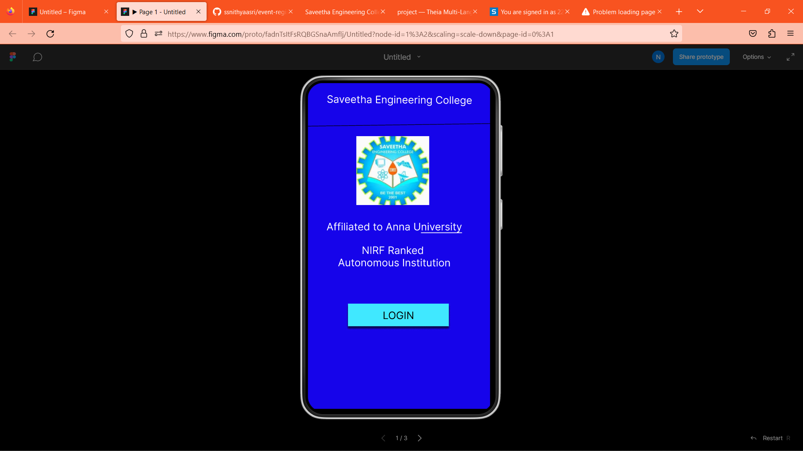
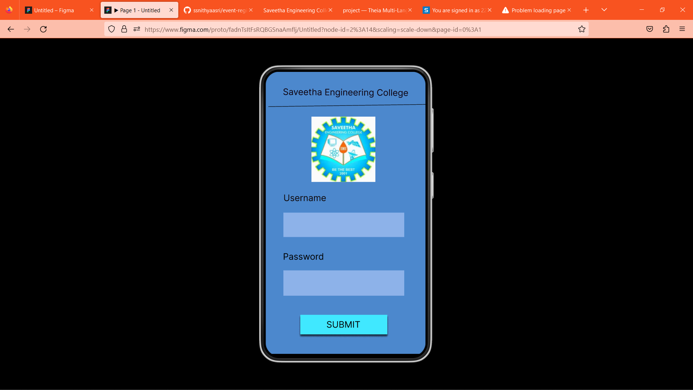
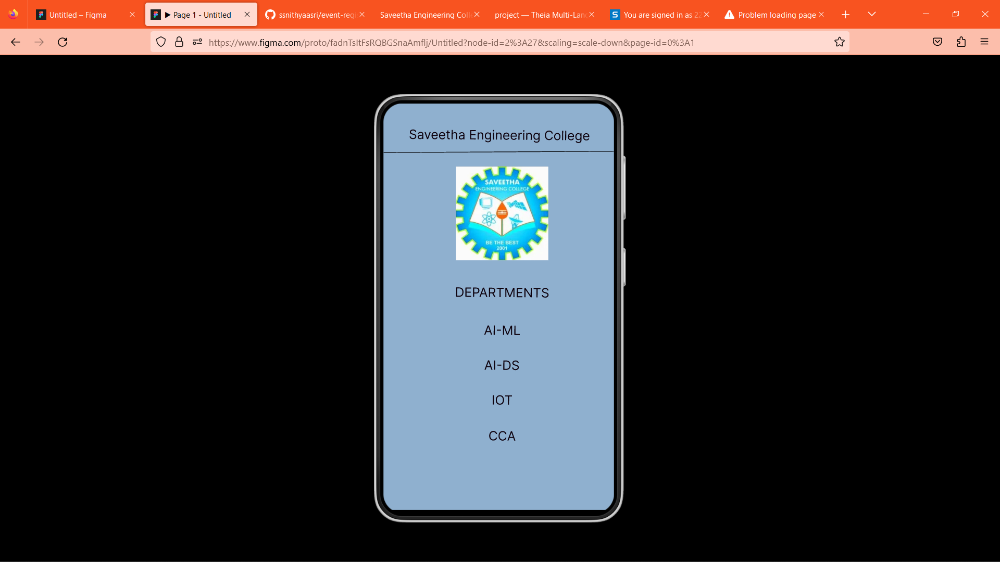

# Event Registration Web Application

## AIM:
To design, develop and deploy a web application for event registration.

## DESIGN STEPS:

### Step 1:
create a new frame.

### Step 2:
Select any one preset size of your choice.

### Step 3:
Select the shapes you need.

### Step 4:
Import images as needed.

### Step 5:
create pages based on your need and link them.

### Step 6:

Validate the HTML and CSS code.

### Step 6:

Publish the website in the given URL.

## DESIGN TOOL:
event-registration

## code:
/* Home Page */
position: relative;
width: 354px;
height: 635px;
background: #1604EA;

/* Login Page */
position: relative;
width: 369px;
height: 635px;
background: #4C88CD;

/* Saveetha Engineering College */
position: absolute;
width: 324.37px;
height: 38.12px;
left: 18.69px;
top: 36px;
font-family: 'Inter';
font-style: normal;
font-weight: 400;
font-size: 20px;
line-height: 24px;
text-align: center;
color: #0D010D;
transform: matrix(1, 0.01, -0.01, 1, 0, 0);

/* DEPARTMENTS */
position: absolute;
width: 315.63px;
height: 46.56px;
left: 27.38px;
top: 282px;
font-family: 'Inter';
font-style: normal;
font-weight: 400;
font-size: 20px;
line-height: 24px;
text-align: center;
color: #0D010D;
transform: rotate(0.46deg);

/* AI-ML */
position: absolute;
width: 315.63px;
height: 46.56px;
left: 27.38px;
top: 341px;
font-family: 'Inter';
font-style: normal;
font-weight: 400;
font-size: 20px;
line-height: 24px;
text-align: center;
color: #0D010D;
transform: rotate(0.46deg);

/* AI-DS */
position: absolute;
width: 315.63px;
height: 51.91px;
left: 26.93px;
top: 395.59px;
font-family: 'Inter';
font-style: normal;
font-weight: 400;
font-size: 20px;
line-height: 24px;
text-align: center;
color: #0D010D;
transform: rotate(0.46deg);

/* IOT */
position: absolute;
width: 315.63px;
height: 32.76px;
left: 27.27px;
top: 450px;
font-family: 'Inter';
font-style: normal;
font-weight: 400;
font-size: 20px;
line-height: 24px;
text-align: center;
color: #0D010D;
transform: rotate(0.46deg);

/* CCA */
position: absolute;
width: 315.63px;
height: 32.76px;
left: 27.27px;
top: 506px;
font-family: 'Inter';
font-style: normal;
font-weight: 400;
font-size: 20px;
line-height: 24px;
text-align: center;
color: #0D010D;
transform: rotate(0.46deg);

/* Line 3 */
position: absolute;
width: 370.01px;
height: 0px;
left: 0px;
top: 77px;
background: linear-gradient(0deg, rgba(0, 0, 0, 0.2), rgba(0, 0, 0, 0.2)), linear-gradient(0deg, rgba(0, 0, 0, 0.2), rgba(0, 0, 0, 0.2)), linear-gradient(0deg, rgba(0, 0, 0, 0.2), rgba(0, 0, 0, 0.2)), linear-gradient(0deg, rgba(0, 0, 0, 0.2), rgba(0, 0, 0, 0.2)), #D9D9D9;
transform: rotate(-0.31deg);

/* logo 3 */
position: absolute;
width: 144px;
height: 147px;
left: 113px;
top: 98px;

background: url(WhatsApp Image 2023-01-27 at 23.55.jpg);

## OUTPUT:

## Result:
The program to design ,develop and display a web application for event registration is completed successfully
